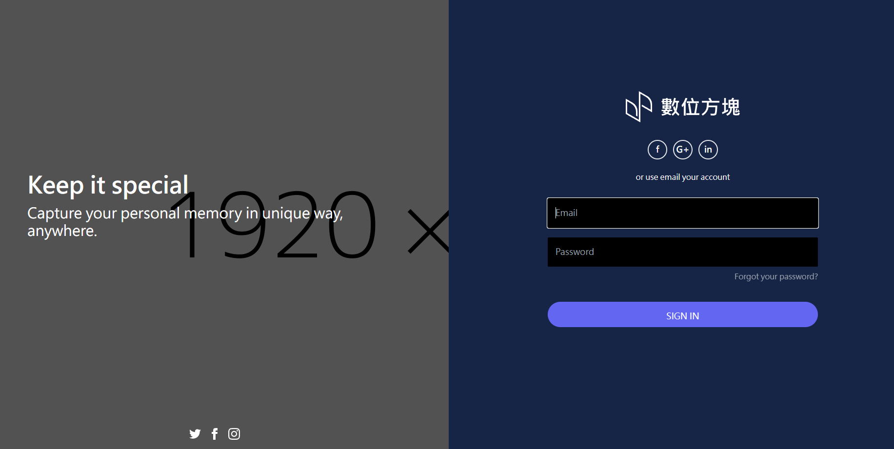

# DIGIpack

早期練習作品：電商購物頁面切版（HTML / CSS / JavaScript）。

## 頁面

- `index.html`：首頁
- `login.html`：登入頁
- `shopping01.html` ~ `shopping04.html`：購物流程頁面

`0516更新版(限制購買數量避免跑版)/` 為後續修改的版本，加入購買數量上限，避免數字過長造成版面跑掉。

## 技術

HTML、CSS、JavaScript
